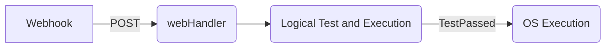

# Go Webhook Receiver

A general purpose Golang application that receives POST requests, performs logical tests on the incoming payload's parameters and makes OS executions following successful tests.

## Quick start
1. Install Go, clone this repo
2. `cd example; go run .`
3. In another terminal `cd payload-test; go run .`

## Example
See https://github.com/corinz/go-webhook-receiver/blob/dev/example/example.go

## Diagram

## Developing with go-webhook-receiver

Import the project 
`import "github.com/corinz/go-webhook-receiver"`

## Logical Tests

This project has basic logical tests that are implemented using native logical operators
|                |User Syntax                          |Go Operator                        |
|----------------|-------------------------------|-----------------------------|
|Equals|`eq`            |`==`           |
|Not equal          |`ne`            |`!=`         |
|Greater than         |`gt`|`>`|
|Less than         |`lt`|`<`|